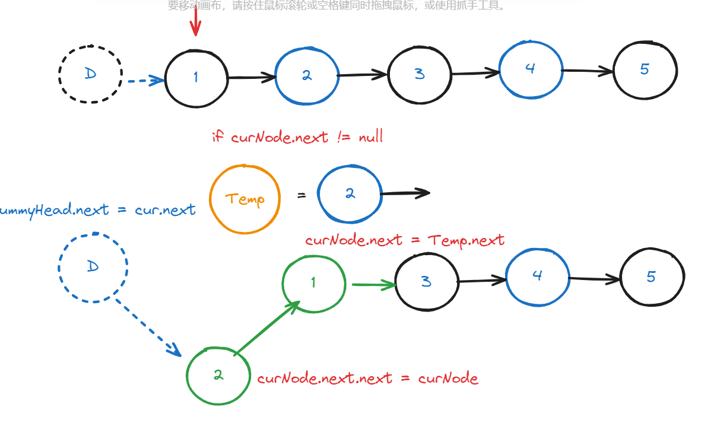
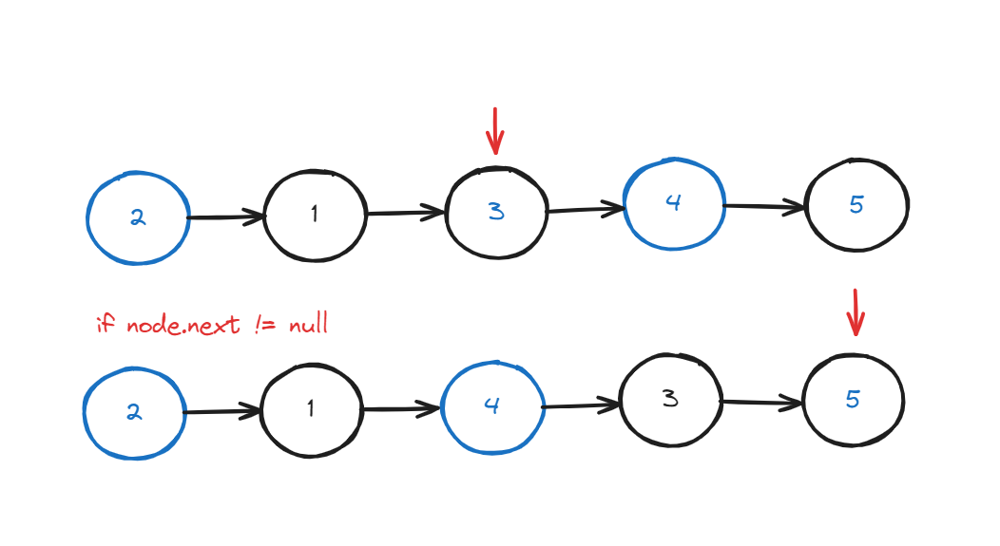
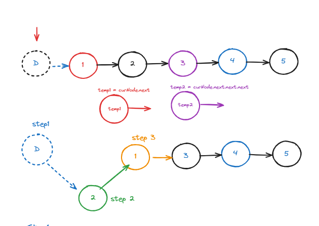
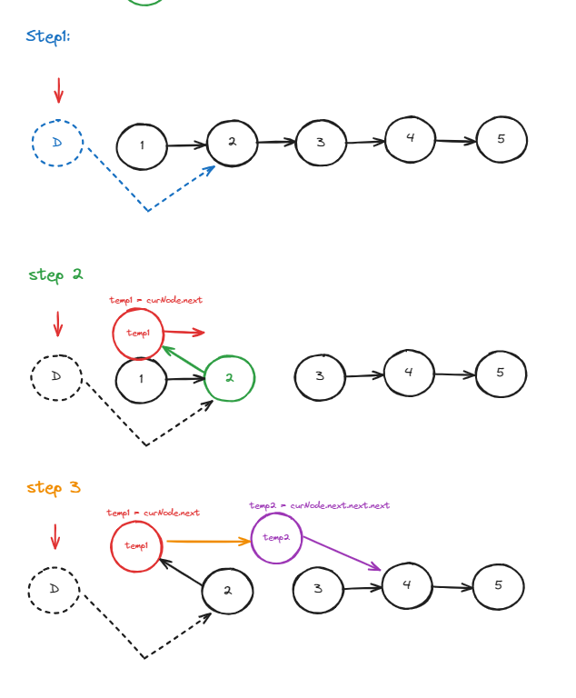
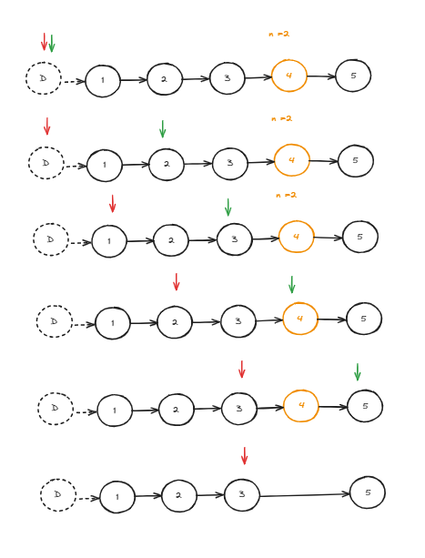

# Day03: Linked List

### LC [24] Swap Nodes in Pairs
- My Idea:
    
    
  - TC: O(n)

  - MC: O(n)


​    

  | Bugs | Test Case & Excepted Output | My Output | Debug |
  | ---- | --------------------------- | --------- | ----- |
  |   Time Limit Exceeded   |   [1,2,3,4] & 2                          |   ERROR        |   curNode Point to wrong nodes    |
- Method one:curNode指向的是需要交换的两个节点的前一个节点，这样才能修改后两个节点的位置，不然会像我想法一样乱了。
note: using Temp Node




  - TC: O(n)

  - MC: O(n)

  - Code:
   
    ```c#
    /*
     * @lc app=leetcode id=24 lang=csharp
     *
     * [24] Swap Nodes in Pairs
     */
    
    // @lc code=start
    /**
     * Definition for singly-linked list.
     * public class ListNode {
     *     public int val;
     *     public ListNode next;
     *     public ListNode(int val=0, ListNode next=null) {
     *         this.val = val;
     *         this.next = next;
     *     }
     * }
     */
    public class Solution {
        public ListNode SwapPairs(ListNode head) {
            ListNode dummyHead = new ListNode(-1,head);
            
            ListNode curNode = dummyHead;
    
            while(curNode.next != null && curNode.next.next != null){
                ListNode tempNode1 = curNode.next;
                ListNode tempNode2 = curNode.next.next.next;
                //step1
                curNode.next = tempNode1.next;
    
                //step 2
                curNode.next.next = tempNode1;
    
                //step 3
                curNode.next.next.next = tempNode2;
    
                curNode =curNode.next.next;
            }
    
            return dummyHead.next;
    
        }
    }
    // @lc code=end
    ```
    
### LC [19] Remove Nth Node From End of List


- My Idea: 通过计算出链表长度，获得倒数n节点的

  - Code **N/A**
    ```csharp
    /*
     * @lc app=leetcode id=19 lang=csharp
     *
     * [19] Remove Nth Node From End of List
     */
    
    // @lc code=start
    /**
     * Definition for singly-linked list.
     * public class ListNode {
     *     public int val;
     *     public ListNode next;
     *     public ListNode(int val=0, ListNode next=null) {
     *         this.val = val;
     *         this.next = next;
     *     }
     * }
     */
    public class Solution {
        public ListNode RemoveNthFromEnd(ListNode head, int n) {
            ListNode dummyHead = new ListNode(-1,head);
    
            ListNode curNode = dummyHead;
            
            //get the length of the linked list
            int len = 0;
            while(curNode!= null){
                len++;
                curNode = curNode.next;
               
            }
             Console.Write("len {0} \n", len);
            curNode = dummyHead;
            ListNode preNode = new ListNode(-99);
            ListNode postNode = new ListNode(-99);
            //get the node before and after nth node
            for (int pointer = 0; pointer < len; pointer++)
            {
              
                if(pointer == (len - n - 1)){
                    preNode = curNode;
                    Console.Write("pre: {0} \n",preNode.val);
                }
                
                if(pointer == (len - n + 1 )){
                    postNode = curNode;
                    Console.Write("post: {0} \n",postNode.val);
                }
                curNode = curNode.next;
            }
            preNode.next = postNode;
    
            return dummyHead.next;
        }
    }
    // @lc code=end
    
    ```
    
    

  | Bugs | Test Case & Excepted Output | My Output | Debug |
  | ---- | --------------------------- | --------- | ----- |
  |      | [1] &1                      | [-99]       |       |
  |      | [1,2] &1                      | [-99]       |   边界case处理不当    |

  

- Method one: Double pointer. 如果要删除倒数第n个节点，让fast移动n步，然后让fast和slow同时移动，直到fast指向链表末尾。将slow指向的节点后移，删除slow节点指向的节点即可。 

  
  - note: Slow pointer should point to the node before the node need to be deleted
  
  - 
  
  - Code:
    ```csharp
    /*
     * @lc app=leetcode id=19 lang=csharp
     *
     * [19] Remove Nth Node From End of List
     */
    
    // @lc code=start
    /**
     * Definition for singly-linked list.
     * public class ListNode {
     *     public int val;
     *     public ListNode next;
     *     public ListNode(int val=0, ListNode next=null) {
     *         this.val = val;
     *         this.next = next;
     *     }
     * }
     */
    public class Solution {
        public ListNode RemoveNthFromEnd(ListNode head, int n) {
            ListNode dummyHead = new ListNode(-1,head);
    
            ListNode slow = dummyHead;
            ListNode fast = dummyHead;
    
            int i = n;
            while(i != 0 && fast != null){
                fast = fast.next;
                i--;
            }
            
            while(fast.next != null){
                slow = slow.next;
                fast = fast.next;
            }
    
            slow.next = slow.next.next;
           
            return dummyHead.next;
        }
    }
    // @lc code=end
    
    ```
  
    
  
