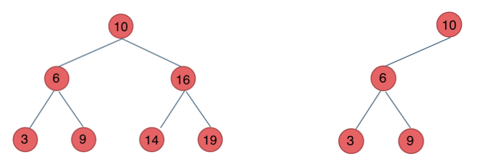
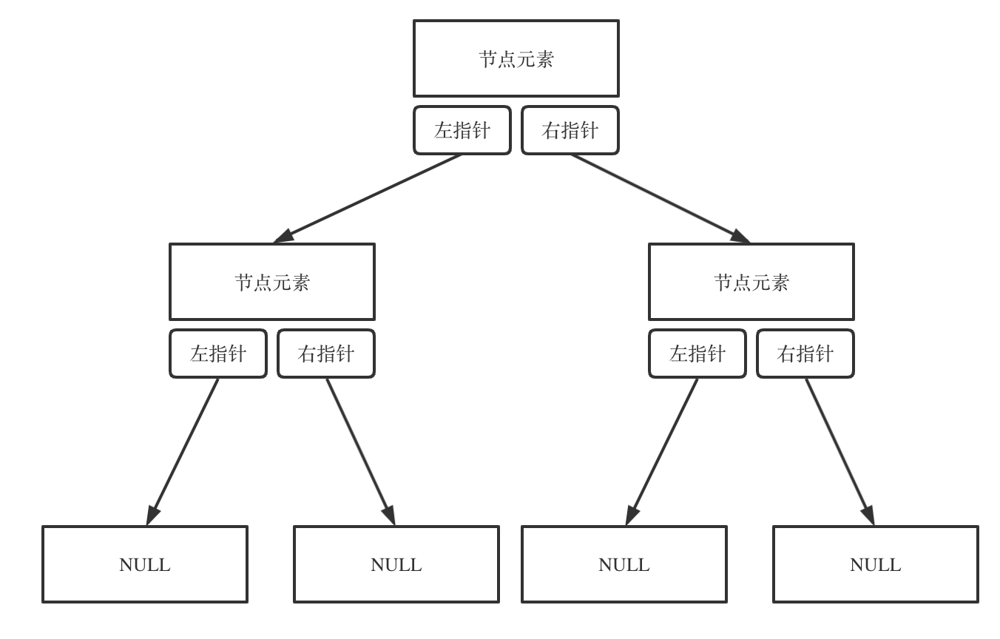
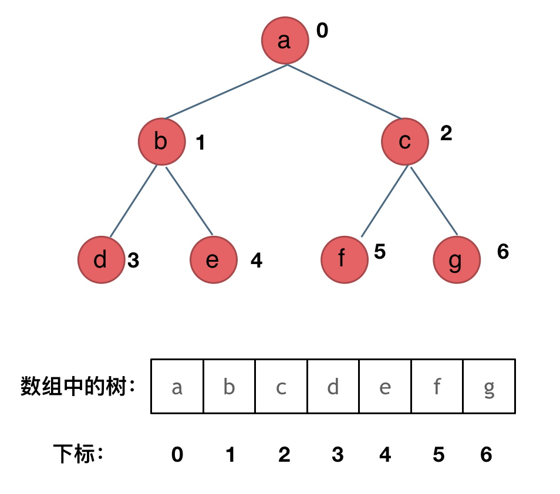
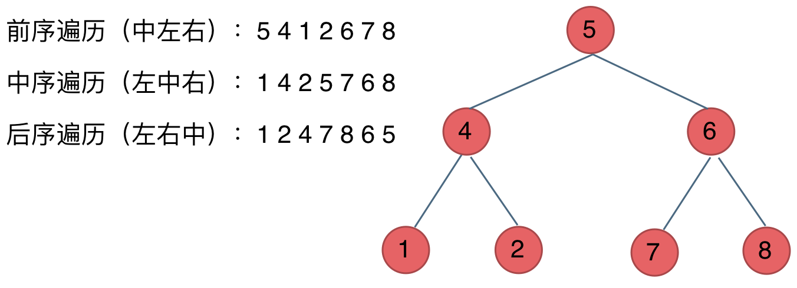

# Day13

## Topic Binary Tree

### Type
- Full binary tree: every node has 0 or 2 children. 优先级队列其实是一个堆，堆就是一棵完全二叉树，同时保证父子节点的顺序关系。

- Bainry Search Tree: 左子树的所有节点都小于根节点，右子树的所有节点都大于根节点。二叉搜索树是一个有序树.

- Adelson-Velsky and Landis (Balanced Binary Search Tree): AVL树是一种自平衡二叉搜索树，任何节点的两个子树的高度最大差别为1，所以它也被称为高度平衡树。查找、插入和删除在平均和最坏时间都是O(log n)。
  
    > 在 C# 中，有一些基于二叉树实现的数据结构。其中，`SortedDictionary` 和 `SortedSet` 是两个基于二叉搜索树（Binary Search Tree，BST）的数据结构。这些数据结构使用红黑树（Red-Black Tree）来实现，红黑树是一种自平衡的二叉搜索树，它确保在插入和删除操作后树的高度保持相对较小，从而提供较好的性能。

  1. **SortedDictionary:**
     - `SortedDictionary<TKey, TValue>` 是一个泛型集合，实现了 `IDictionary<TKey, TValue>` 接口。
     - 它根据键的顺序维护键值对，并在内部使用红黑树来实现。

     ```csharp
     SortedDictionary<string, int> myDictionary = new SortedDictionary<string, int>();
     ```

  2. **SortedSet:**
     - `SortedSet<T>` 是一个泛型集合，实现了 `ISet<T>` 接口。
     - 它表示一个按顺序排列且不包含重复元素的集合，内部也使用红黑树来实现。

     ```csharp
     SortedSet<int> mySet = new SortedSet<int>();
     ```


### Storage Method
- Linked Storage: using **pointer** to connect each node.
    
- Sequential Storage: using **array** to store the node.
    

### Traversal
- Wide First Search: 从上到下，从左到右
  - 递归实现
- Deep First Search: 从上到下，从左到右
  - 递归实现
  - 非递归实现
    - 前序遍历(Fist Order Traversal): 根节点 -> 左子树 -> 右子树
      - 确定递归的参数和返回值：参数就是当前节点，返回值无。
        ```csharp
        public void PreOrder(TreeNode root)
        {
        }
        ```
      - 确定终止条件
        ```csharp
        public void PreOrder(TreeNode root)
        {
            if (root == null) // 如果当前节点为空，就返回
            {
                return;
            }
        }
        ```
      - 确定单层递归的逻辑
        ```csharp
        public void PreOrder(TreeNode root)
        {
            Console.WriteLine(root.val); // 先打印当前节点的值(中节点)
            PreOrder(root.left); // 递归遍历左子树
            PreOrder(root.right); // 递归遍历右子树
        }
        ```
        前序遍历的递归实现
        ```csharp
        public void PreOrder(TreeNode root)
        {
            if (root == null)
            {
                return;
            }
        
            Console.WriteLine(root.val);
            PreOrder(root.left);
            PreOrder(root.right);
        }
        ```
    - 中序遍历(In Order Traversal): 左子树 -> 根节点 -> 右子树
        ```csharp
        public void InOrder(TreeNode root)
        {
            if (root == null)
            {
                return;
            }
        
            InOrder(root.left);
            Console.WriteLine(root.val);
            InOrder(root.right);
        }
        ```
    - 后序遍历(Last Order Traversal): 左子树 -> 右子树 -> 根节点
        ```csharp
        public void LastOrder(TreeNode root)
        {
            if (root == null)
            {
                return;
            }
        
            LastOrder(root.left);
            LastOrder(root.right);
            Console.WriteLine(root.val);
        }
        ```
  



### Binary Tree Definition
```csharp
public class TreeNode
{
    public int val;
    public TreeNode left;
    public TreeNode right;
    public TreeNode(int x) { val = x; }
}
```


### 

## Problems

### LC [[144] Binary Tree Preorder Traversal](https://leetcode.com/problems/binary-tree-preorder-traversal/submissions/1143129551/)
```csharp
    /*
    * @lc app=leetcode id=144 lang=csharp
    *
    * [144] Binary Tree Preorder Traversal
    */

    // @lc code=start
    /**
    * Definition for a binary tree node.
    * public class TreeNode {
    *     public int val;
    *     public TreeNode left;
    *     public TreeNode right;
    *     public TreeNode(int val=0, TreeNode left=null, TreeNode right=null) {
    *         this.val = val;
    *         this.left = left;
    *         this.right = right;
    *     }
    * }
    */
    public class Solution {
        public IList<int> PreorderTraversal(TreeNode root) {
            
            return myTraversal(root, new List<int>());
        }

        private IList<int> myTraversal(TreeNode root, IList<int> result){
            
            if(root == null){
                return result;
            }

            result.Add(root.val);

            myTraversal(root.left, result);
            myTraversal(root.right, result);

            return result;
        }
    }
    // @lc code=end


```

### LC[[145] Binary Tree Postorder Traversal](https://leetcode.com/problems/binary-tree-postorder-traversal/)
```csharp
    /**
    * Definition for a binary tree node.
    * public class TreeNode {
    *     public int val;
    *     public TreeNode left;
    *     public TreeNode right;
    *     public TreeNode(int val=0, TreeNode left=null, TreeNode right=null) {
    *         this.val = val;
    *         this.left = left;
    *         this.right = right;
    *     }
    * }
    */
    public class Solution {
        public IList<int> PostorderTraversal(TreeNode root) {
            //注意这里只能使用new创建List不能创建IList
            return myRecursive(root, new List<int>());
        }
        
        private IList<int> myRecursive(TreeNode root, IList<int> res){
            if(root == null){
                return res;
            }

            myRecursive(root.left,res);
            myRecursive(root.right,res);
            res.Add(root.val);

            return res;
            
        }
    }
```

### LC[ [94] Binary Tree Inorder Traversal](https://leetcode.com/problems/binary-tree-inorder-traversal/)
```csharp
    /**
    * Definition for a binary tree node.
    * public class TreeNode {
    *     public int val;
    *     public TreeNode left;
    *     public TreeNode right;
    *     public TreeNode(int val=0, TreeNode left=null, TreeNode right=null) {
    *         this.val = val;
    *         this.left = left;
    *         this.right = right;
    *     }
    * }
    */
    public class Solution {
        public IList<int> InorderTraversal(TreeNode root) {
            return myRecursive(root, new List<int>());
        }

        private IList<int> myTraversal(TreeNode root, IList<int> res){
                if(root == null){
                    return res;
                }

                myTraversal(root.left,res);
                res.Add(root.val);
                myTraversal(root.right,res);
            

                return res;
                
            }
    }
```

