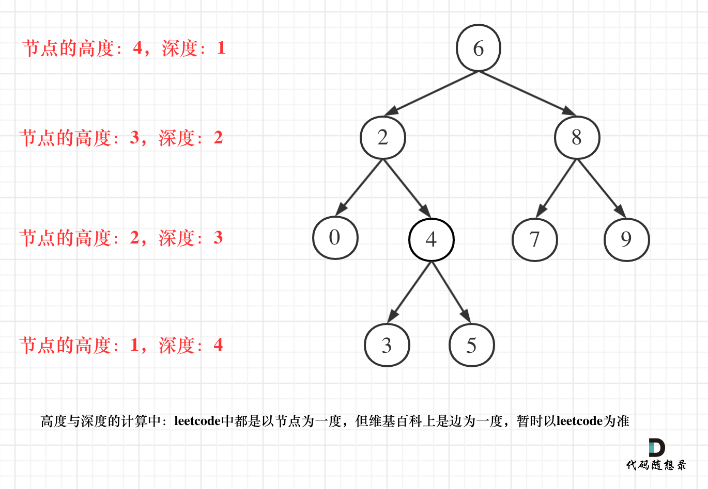

# Day17 Binary Tree04

## Topic: Balanced Binary Tree
Height-balanced binary tree is defined as: a binary tree in which the left and right subtrees of every node differ in height by no more than 1.
- 二叉树节点的深度：指从根节点到该节点的最长简单路径边的条数。
- 二叉树节点的高度：指从该节点到叶子节点的最长简单路径边的条数。
> 但leetcode中强调的深度和高度很明显是按照节点来计算的，如图：

## LeetCode Problems
    
### LC [[110] Balanced Binary Tree](https://leetcode.com/problems/balanced-binary-tree/description/)

#### 递归  
递归法，分别计算左右子树的高度，然后判断是否平衡，如果平衡则返回当前节点的高度，否则返回-1，表示不平衡。

  - Code 
    ```csharp
        /*
        * @lc app=leetcode id=110 lang=csharp
        *
        * [110] Balanced Binary Tree
        */

        // @lc code=start
        /**
        * Definition for a binary tree node.
        * public class TreeNode {
        *     public int val;
        *     public TreeNode left;
        *     public TreeNode right;
        *     public TreeNode(int val=0, TreeNode left=null, TreeNode right=null) {
        *         this.val = val;
        *         this.left = left;
        *         this.right = right;
        *     }
        * }
        */
        public class Solution {
            public bool IsBalanced(TreeNode root) {

                return getHeight(root) == -1 ? false : true;

            }

            public int getHeight(TreeNode root){
                if(root == null){
                    return 0;
                }

                int left = getHeight(root.left);
                if(left == -1) return -1;

                int right = getHeight(root.right);
                if(right == -1) return -1;

                if(Math.Abs(left - right) > 1){
                    return -1;
                }
                // 注意理解这里的返回值
                return 1 + Math.Max(left, right);
            }
            
        }
        // @lc code=end


    ```

### LC [[257] Binary Tree Paths](https://leetcode.com/problems/binary-tree-paths/description/)
这道题目要求从根节点到叶子的路径，所以需要前序遍历，这样才方便让父节点指向孩子节点，找到对应的路径。

在这道题目中将第一次涉及到回溯，因为我们要把路径记录下来，需要**回溯**来回退一个路径再进入另一个路径。

使用前序遍历，这样才能让父节点指向孩子节点，找到对应的路径。

  - Code 
    ```csharp
        /*
        * @lc app=leetcode id=257 lang=csharp
        *
        * [257] Binary Tree Paths
        */

        // @lc code=start
        /**
        * Definition for a binary tree node.
        * public class TreeNode {
        *     public int val;
        *     public TreeNode left;
        *     public TreeNode right;
        *     public TreeNode(int val=0, TreeNode left=null, TreeNode right=null) {
        *         this.val = val;
        *         this.left = left;
        *         this.right = right;
        *     }
        * }
        */
        public class Solution {
            public IList<string> BinaryTreePaths(TreeNode root) {
                IList<string> res = new List<string>();
                if(root == null) return res;
                helper(root, "", res);
                return res;
            }

            public void helper(TreeNode root, string path, IList<string> res){
                if(root == null) return;
                path += root.val;
                if(root.left == null && root.right == null){
                    res.Add(path);
                }else{
                    path += "->";
                    helper(root.left, path, res);
                    helper(root.right, path, res);
                }
            }
        }
        // @lc code=end

    ```